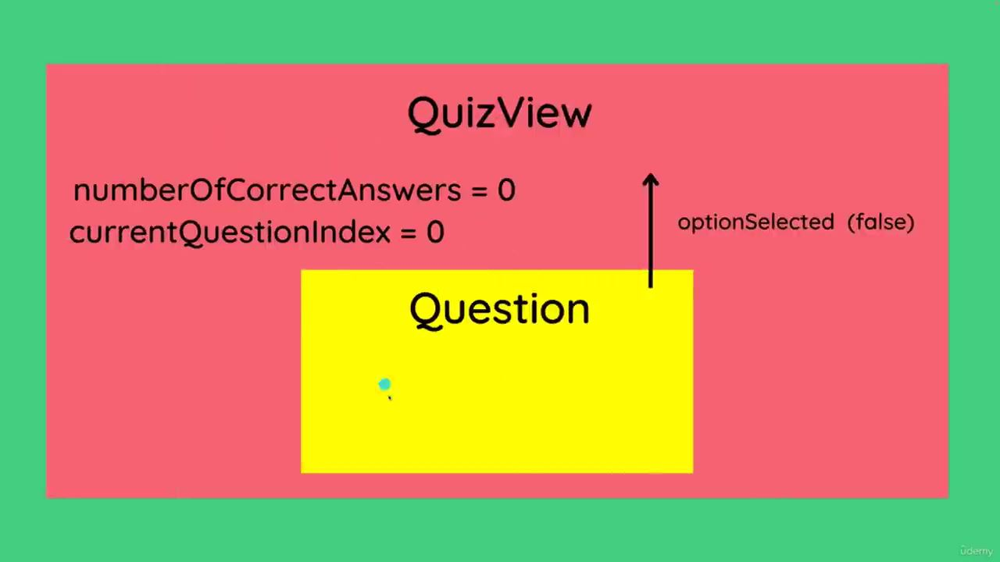

## Things Learned
1. `<script setup>`
-- is a shorthand for the composition API

2.  **scoped** attribute in a style tag 
-- is used to create scoped styles for a specific component. When you include the scoped attribute in a style tag within a Vue component, it means that the styles defined in that tag will only apply to elements within that specific component and `won't leak outside`.

3. **ref()** as State Storage
-- `const showModal = ref(false)`

-- `const newNote = ref("")`

4. **Directives** are instructions for Vue to do certain things
-- example: `v-if=showModal` = it will render the component if `showModal = true`
-- `v-if` vs `v-show` : v-show = display: none,   v-if = dont show the component at all

5. **v-model** derectives for Two Way Binding
if we update through state it will chanche in `textarea` and vice viersa

6. **v-for** directives
for looping component fragment,
-- it needs `:key="<unique value>"` for update tracing to avoid unnecessary re-render

7. **:** is a shorthand for **v-bind**
This is binding the style attribute of an HTML element to a JavaScript object.

8. **watch** from vue
  ```javascript
  watch(search, () => {
    quizes.value = q.filter(quiz => quiz.name.toLowerCase().includes(search.value.toLowerCase()))
  })```
-- is used to watch for changes in the data of a component and perform some action when that data changes.

9. **split file App.vue**
-- from App.vue to App.vue & Card.vue
-- benefits: isolated code & reusability

10. **Props** to pass data in Vuejs
-- `:quiz="quiz"` passing quiz
-- to use props: 
```javascript
  import { DefineProps } from 'vue';

  const {quiz}  = defineProps(['quiz'])
  ```

11. __Vue Routing is Illusions__
-- it's because Vue is `single page application`
-- this is also happen in `react-router-dom`

12. install `vue-router` 
-- first explanation of vue-router is in LearnVueRouter project

13.  `import { computed } from 'vue'` anytime we want to compute a certain value that based of another value
```javascript
// INSTEAD OF THIS
// const questionStatus = ref(`${currentQuestionIndex.value}/${quiz.questions.length}`)
// watch(() => currentQuestionIndex.value, () => {
//    questionStatus.value = `${currentQuestionIndex.value}/${quiz.questions.length}`
// })

// DO THIS
const questionStatus = computed(() => {
  return `${currentQuestionIndex.value}/${quiz.questions.length}`
})
```

14. `defineEmits` allows you to declare the events a component can emit to its parent.
-- kebalikan dari `defineProps`
```js
// IN CHILD COMPONENT (Question.vue)
const emit = defineEmits(['selectOption']) //selectOption event

const emitSelectedOption = (isCorrect) => {
  emit('selectOption', isCorrect)
}


<div v-for="option in question.options" :key="option.id" class="option" @click="emitSelectedOption(option.isCorrect)">
```
``` js 
// IN PARENT COMPONENT (QuizView.vue)
const numberOfCorrectAnswers = ref(0)
const onOptionSelected = (isCorrect) => {
 if(isCorrect) {
  numberOfCorrectAnswers.value++
 }
 currentQuestionIndex.value++
}

<Question :question="quiz.questions[currentQuestionIndex]" @selectOption="onOptionSelected"/>
```
